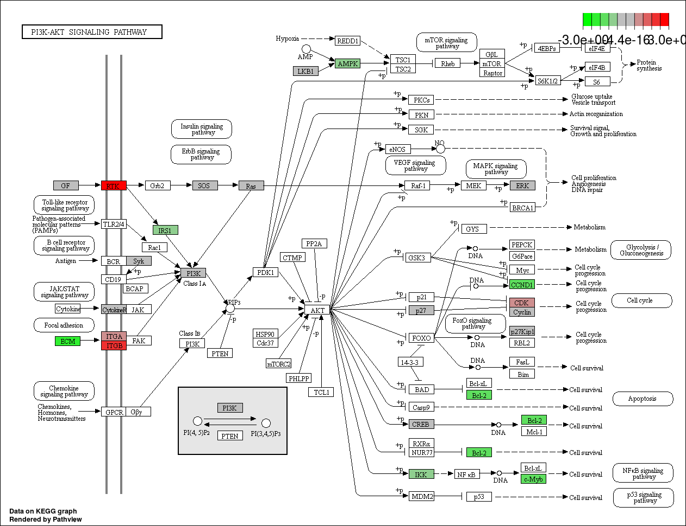

---
output:
  html_document:
    df_print: paged
    toc: true
    toc_float: true
    code_folding: hide
    toc_depth: 5
    theme: flatly
params:
  set_title: !r markdown.params$title
  set_author: !r markdown.params$author
  set_date: !r markdown.params$date
  set_sample_type: !r markdown.params$sample_type
  set_sample_associate: !r markdown.params$sample_associate
---

---
title: `r params$set_title`
author: `r params$set_author`
date: `r params$set_date`
output: html_document
---


```{r setup, include=FALSE}
knitr::opts_chunk$set(echo = TRUE, message = F)
```

### Introduction

This experiment is a full differential expression analysis of `r params$set_sample_type` samples to find the changes in gene expression associated with `r params$set_sample_associate`. 

The analysis protocol is based on the sequential execution of the following steps:

1. Load RCC files. Build counts matrix
2. Data normaliZation
3. Differential expression analysis
4. Pathway analysis

### Execution
#### Load the data
Get a matrix with the raw counts from the set of samples we want to analyse.

We are working with `r nrow(metadata)` samples. We might need more samples to obtain significant results.

#### QC Control an normalisation.
We monitor some QC aspects and normalise the data according to several criteria.

##### Imaging QC

```{r echo=T,message=F, warning=F}

# Field of View (FOV) Plots
plotFOV(eset = eset, metadata = metadata, fov.threshold = opt$fov,
        comparison.key = key.label, legend.label = opt$label)

```


##### Binding density QC
Due to the nature of the nCounter technology, analysis of some samples may produce too many or too few probes to be accurately counted by the Digital Analyzer. When too many probes are present, the Digital Analyzer is not able to distinguish each and every probe present in the lane. When too few fluorescent species are present, the Digital Analyzer may have difficulty focusing on the lane surface. Therefore, a measurement of mean binding density (spots per square micron) is provided with each lane scanned. The linear range of counting extends from 0.05 to 2.25 spots per square micron for assays run on an nCounter MAX or FLEX system. The range is 0.05 to 1.18 spots per square micron for assays run on the nCounter SPRINT system.  (see nSolver User Manual).

```{r echo=T,message=FALSE, warning=FALSE}
# Binding Density (BD) Plots
plotBD(eset = eset, metadata = metadata, y.thresholds = c(opt$bd_min, opt$bd_max),
       comparison.key = key.label, legend.label = opt$label)
```


##### Positive Controls

Check the expression of the positive controls. The positive genes follow the expeted pattern of expresssion.

```{r echo=T,message=FALSE, warning=FALSE}
# Positive Controls
boxplot.expr(eset,is.positive)
```


Check the expression of the negative controls

```{r echo=T,message=FALSE, warning=FALSE}
# Negative Controls
boxplot.expr(eset,is.negative)

```

##### Noise Threshold

We establish a noise threshold. This threshold is based on the mean and standard deviation of counts of the negative control genes and represents the background noise. We define it as the mean expression of the negative genes counts + 2 times the standard deviation.

```{r echo=T,comment=F, warning=F}
# Noise Threshold
lodcounts <- extract.pred(eset, is.negative)
lod <- mean(lodcounts$count) + 2 * sd(lodcounts$count)
```

##### Housekeeping genes

Expression of each housekeeping genes in all samples. The line in red represents the noise threshold.

We can observe that all the housekeeping genes have enough expression (above the noise threshold).

```{r, echo=T, message=F}
# Housekeeping Genes
housekeeping.boxplot<-boxplot.expr(eset,is.housekeeping)
housekeeping.boxplot+geom_hline(yintercept = (lod),colour="red")
```

##### Expression of all the housekeeping genes in each sample.

We plot the mean expression of all the housekeeping genes in each sample. We can obverve that some sample have overall low expression for the housekeeping genes, but all are above the noise threshold.

```{r, echo=T,comment=F, warning=F}
# Expression of all the housekeeping genes in each sample
housekeeping.condition.boxplot+geom_hline(yintercept = (lod),colour="red")
```

##### General expression

Expression of all genes (Endogenous + Housekeeping).

```{r, echo=T, warning=F, message=F}
# Expression of multiple condition genes in each sample
endogenous.housekeeping.condition.boxplot+geom_hline(yintercept = (lod),colour="red")
```


#### Normalization
##### Positive Normalization

We perform a normalization using the expression of the positive genes. This attempts to normalize for technical noise across the samples

```{r, echo=T}
pre.normalization.boxplot + geom_hline(yintercept = lod,colour="red")
```


```{r, echo=T}
post.normalization.boxplot + geom_hline(yintercept = lod,colour="red")
```

We can see that this normalisation doesn't make the samples look better.


##### Housekeeping normalization

We select thouse housekeeping genes that have expression values greater than the noise threshold and a mean value of expression of at least 200 counts.

Using those genes, we observe that samples obtain more similar profiles.

```{r, echo=T}
housekeeping.post.normalization.boxplot + geom_hline(yintercept = lod,colour="red") + geom_smooth(se=T, aes(group=1))
```


##### Drop genes and produce the normalised counts matrix
We’ll drop the genes that are below the LOD in over 80% of the samples:

```{r, echo=T}
# SHOW THIS?
```

We can save the metadata dataframe and the normalised counts matrix for further analysis.

```{r, echo=T}
# ALREDY SAVE
```

##### PCA
A PCA (Principal Component Analysis) performs a transformation over the data in order to obtain orthogonal vectors in such a way that the first principal component has the largest possible variance (that is, accounts for as much of the variability in the data as possible), and each succeeding component in turn has the highest variance possible under the constraint that it is orthogonal to the preceding components.

Plotting the samples in this transformed system show which samples are more similar. Here we scaled and centered the normalized data and then performed PCA to look at how the samples cluster. The samples do not cluster clearly along components 1-3 by their invasive potential, which indicates the samples are more variable than the signal, if the signal exists.


```{r, echo=T, message=FALSE, warning=FALSE}
plotPCA(comps, pc, PRINCIPAL.COMPONENT.X, PRINCIPAL.COMPONENT.Y, key.label
        , legend.label =  opt$label, plot.title = PCA.PLOT.TITLE)

```


#### DEA
DEA by the DESeq2 library. The ncounts matrix is converted to integers for the analysis. The original counts are preserved in `counts(dds)`. 

See [this thread](https://www.biostars.org/p/101727/) for log2FC.

```{r, echo=TRUE,warning=F, message=F}
# SHOW THIS?
```

The results of the differential expression analysis:
```{r echo=TRUE,warning=F, message=F}
dplyr::select(dea.p, type, gene.name, id, baseMean, log2FoldChange, pvalue, padj)
```


We see the `r nrow(dea.p)` genes sorted by log2FC with significantly altered expression between samples of invasive tumours and samples with non-invasive tumours. We can show the results of the differential expression analysis as a volcano plot. A volcano plot typically plots some measure of effect on the x-axis (typically the fold change) and the statistical significance on the y-axis (typically the -log10 of the p-value). Genes that are highly dysregulated are farther to the left and right sides, while highly significant changes appear higher on the plot.

```{r message=FALSE, warning=FALSE}
plot.Volcano(tab, tab2, opt$log_fc, opt$dea_pvalue, plot.title = "Volcano Plot")
```


#### Pathway Analysis

We perform a classic enrichment analysis in GO and KEGG for all the genes differentially epressed by NAC.
```{r, echo=TRUE,message=F, warning=F}
#res<- getDE.raw(ncounts = round(ncounts), metadata = metadata, design = design) # the core script for the pathway analysis expects a dataframe with the DEA named res

#We need to first pull out the Refseq IDs from the Nanostring IDs and convert those to Entrez IDs. Not all of the genes have Entrez IDs, however, #we lose `r lost.genes` genes through this conversion. 
#converted = unlist(lapply(strsplit(res$rowname, "_", fixed = TRUE), "[", 4))
#converted = unlist(lapply(strsplit(converted, ".", fixed = TRUE), "[", 1))
#converted = paste0("NM_", converted)
#res$refseq_mrna = converted

#lost.genes = length(res$rowname) - length((res %>% data.frame() %>% left_join(entrez, by = "refseq_mrna") %>% 
#        filter(!is.na(entrezgene)) %>% filter(!is.na(log2FoldChange)) %>% filter(!is.na(lfcSE)))$rowname)

#enrich_rs = enrich_cp(res, "Invasiveness", type="all")
#enrich_rs = enrich_rs
#enrich_summary = enrich_rs$summary %>% arrange(p.adjust)
#enrich_summary = convert_enriched_ids(enrich_summary,entrezsymbol = entrezsymbol) %>% arrange(p.adjust)
#write_csv(x = enrich_summary,path = "NAC_enrichment.csv" )
```

The pathways enriched in genes with altered expression among our samples are presented in a table:
```{r echo=T, message=F, warning=F}
enrich.rs.summary
enrich.rs.over.summary
enrich.rs.under.summary
```

Finally, we can see the KEGG pathways enriched.

<!-- GO BP Enrichment in all the significantly expressed genes: -->
```{r,echo=TRUE}
dotplot(enrich.rs$kg, x="count", showCategory=10, color="qvalue", title = DOTPLOT.ENRICHMENT.ALL.TITLE)
# KEGG enrichment in over-expressed genes:
dotplot(enrich.rs.over$kg, x="count", showCategory=10, color="qvalue", title = DOTPLOT.ENRICHMENT.OVER.TITLE)
# KEGG enrichment in under-expressed genes
dotplot(enrich.rs.under$kg, x="count", showCategory=10, color="qvalue", title = DOTPLOT.ENRICHMENT.UNDER.TITLE)
```

We can map the genes to a KEGG pathway with this function:
```{r message=FALSE, warning=FALSE, eval=FALSE}
# how do u want to view this?
```

For example, this is how the pathway hsa04151 looks like: 


